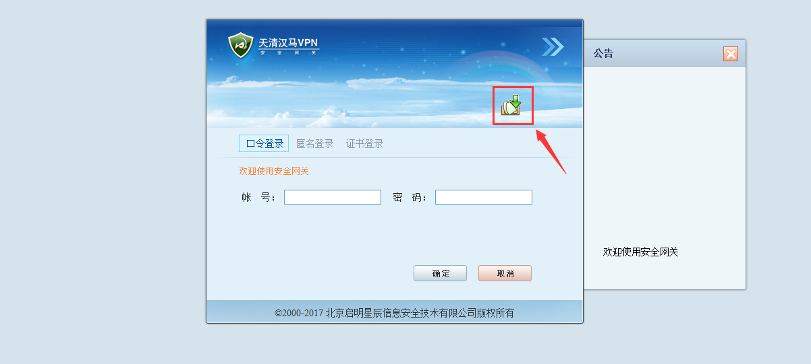
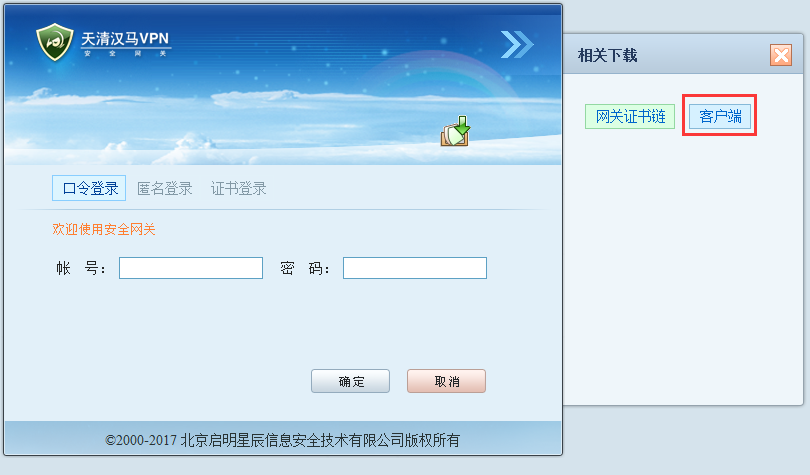
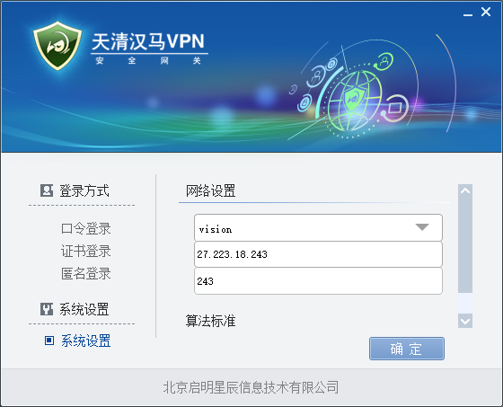
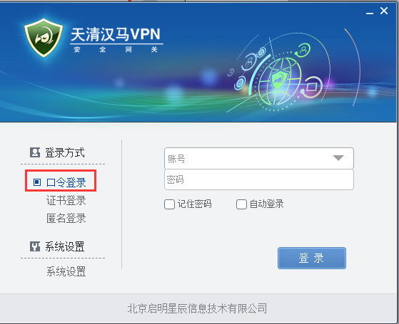

# 如何使用青岛海洋科学与技术国家实验室计算集群

本文档主要记录青岛海洋科学与技术国家实验室为Vision提供的**5**台**8**卡V100服务器计算集群的使用说明

## 目录

1. [注意事项](#注意事项)
2. [准备事项](#准备事项)
3. [使用流程](#使用流程)

## 注意事项

- 该计算集群无法连接外网，无root权限，需要使用docker在本地准备好一个能完全运行的实验环境
- 因网络原因，目前与计算集群连接的网络网速较慢，尽量在docker image中准备完全确定可以执行之后再上传是计算平台

## 准备事项

完整的实验环境包括制作docker image、上传数据集与代码两个部分组成

### 制作docker image

实验室的docker私有仓库为 http://yun.nju.edu.cn:10080/repositories/ 

可以先在 [这里](https://github.com/xulzee/vision/blob/master/docker-registry.md#%E5%A6%82%E4%BD%95%E4%BD%BF%E7%94%A8private-registry) 学习如何使用仓库。

计算平台使用的GPU驱动为418，支持CUDA 9.0 ~ CUDA 10.1，制作镜像时需要注意版本

制作过程中可以先从仓库中拉去一个已经配置好pytorch或tensorflow的镜像，以pytorch为例：

1. 拉取docker image

```bash
sudo docker pull yun.nju.edu.cn:5000/pytorch:1.3-cuda10.1-cudnn7-runtime
```

2. 运行docker image

```bash
docker run --runtime=nvidia -it yun.nju.edu.cn:5000/pytorch:1.3-cuda10.1-cudnn7-runtime bash
```

3. 安装实验所需环境，以安装numpy举例

```bash
root@xxxxxx:~$ pip install numpy
```

4. 修改完成之后，将对镜像的修改保存为新的image

```bash
## 首先在终端按下 ctrl + p + q 退出容器

## 找到容器的id
sudo docker ps -a

## 然后将修改后的容器保存为新的镜像,<container id>为容器id，<imagename>为保存之后的镜像名，命名规则为
## yun.nju.edu.cn:5000/username/name:tag
## 例如： yun.nju.edu.cn:5000/chentong/pytorch:1.3-cuda10.0-cudnn7-runtime-dali
sudo docker commit <container id> <imagename>

## 将该镜像提交到私有仓库
sudo docker push <imagename>
```

5. 将该镜像保存到本地

```bash
sudo docker save -o outputName.tar.gz <container id>
```

6. 此时会得到一个保存下来的tar.gz文件，将该文件上传到计算集群上，上传成功之后在集群上导入镜像

```bash
sudo docker load -i outputName.tar.gz
```

### 上传数据集和代码

由于与计算集群连接的网络不是很好，所以上传之前最好将数据集和代码处理完成压缩成.tar文件再上传给服务器。

## 使用流程

### 1. 连接计算集群

连接计算集群需要使用相应的VPN，在 https://27.223.18.243:243 上下载客户端并安装；





安装成功之后首先设置网关



然后使用口令登录，输入账号密码（找实验室师兄索要）



然后可以使用ssh 连接计算集群登录节点（用户名和密码找实验室师兄索要）

目前集群可以使用的节点为gpu30-gpu34，可以直接使用ssh进行切换，例如：

```bash
ssh gpu30
```

连接上GPU服务器之后，即可运行自己的docker 镜像：

```bash
nvidia-docker run -it <imageName> bash
```

集群所有节点包括登录节点、gpu30-gpu34使用的相同共享文件夹，切换gpu节点时无需进行数据拷贝转移。